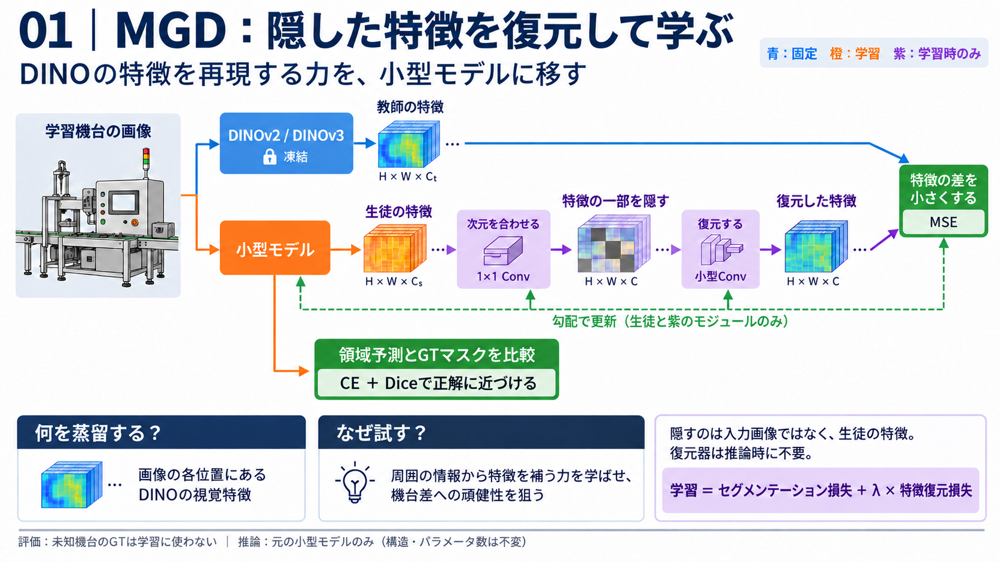
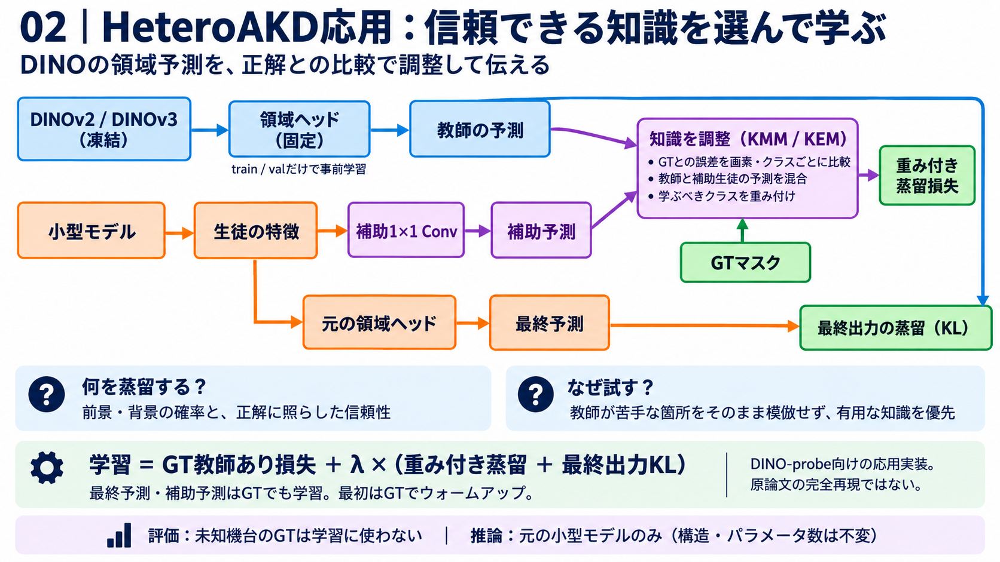
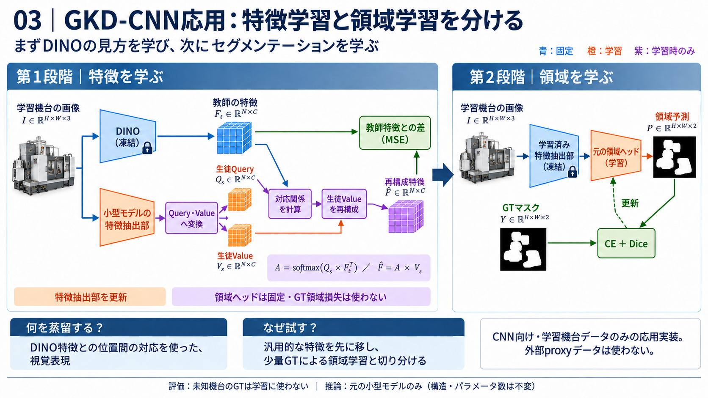

# 知識蒸留3手法：MTG説明用画像

本プロジェクトの実装を説明する日本語スライドです。1手法につき1画像です。
会社画像・データ・学習結果は含みません。図の入力画像や特徴は説明用の模式図です。

| 画像 | 説明のポイント |
| --- | --- |
| [01 MGD](01_mgd.png) | 生徒特徴の一部を隠し、学習時専用の復元器でDINO特徴を復元する。GTによる領域学習と同時に行う。 |
| [02 HeteroAKD応用](02_heteroakd.png) | GTとの誤差から教師と生徒の予測を混合し、クラス重み付き蒸留と最終出力KLを行う。 |
| [03 GKD-CNN応用](03_gkd_cnn.png) | 第1段階でDINO特徴を蒸留し、第2段階で特徴抽出部を凍結して既存領域ヘッドをGTで学習する。 |

## 発表時の説明例

### 01 MGD

「教師のDINOは固定し、生徒の特徴を一部隠します。学習時だけ使う小さな復元器で、DINOの特徴を再現させます。特徴の穴を周囲から補う学習を通じて、小型モデルの表現を強化する狙いです。画像を復元する手法ではありません。」

### 02 HeteroAKD応用

「DINOにtrain/valだけで学習した領域ヘッドを付け、蒸留中は固定します。教師と生徒の予測をGTと比較して、画素・クラスごとに混合率や学習の重みを決めます。教師の出力を無条件に真似せず、有用な知識を優先して学ばせる狙いです。」

補助予測には学習時専用の1×1 Convを使用します。GTウォームアップ後、混合予測への重み付き蒸留に加え、既存最終予測へTeacher→StudentのKL蒸留を行います。単純なconfidence gateではありません。

### 03 GKD-CNN応用

「まず小型モデルの特徴抽出部だけにDINOの見方を移し、その後は特徴抽出部を固定して、領域ヘッドだけをGTで学習します。汎用的な視覚特徴の学習と、業務タスクの学習を切り分けます。」

第1段階の対応重みは生徒Queryと教師特徴から計算しますが、再構成に使うValueは**生徒由来**です。第1段階はGTセグメンテーション損失を使用しません。ただしignore領域の除外にはマスクを使用します。

## 共通の注意

- 未知のtest機台は学習・Teacher probe学習・モデル選択に使用しません。
- 推論時は元の小型モデルだけを使用します。教師・復元器・補助投影は不要で、Studentの構造・パラメータ数は増やしません。
- 「未知機台への性能改善」は検証目的であり、実証済みの効果を示す図ではありません。
- HeteroAKDとGKDはDINO/CNN向けの応用実装です。原論文の完全再現を主張しません。
- 実装差分・参考論文は [KD_METHODS.md](../../KD_METHODS.md)、調査は [調査資料](../../KNOWLEDGE_DISTILLATION_SURVEY_JA.md)を参照してください。
- 画像は組み込み画像生成ツールで作成し、文字・矢印・実装との整合を目視確認済みです。生成・最終修正のプロンプトは [PROMPTS.md](PROMPTS.md)に保存しています。

GitHubでの保存場所：`docs/assets/knowledge_distillation/`。
